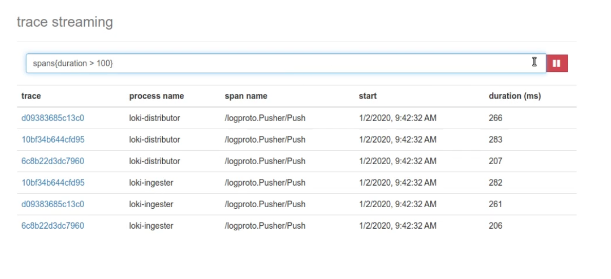
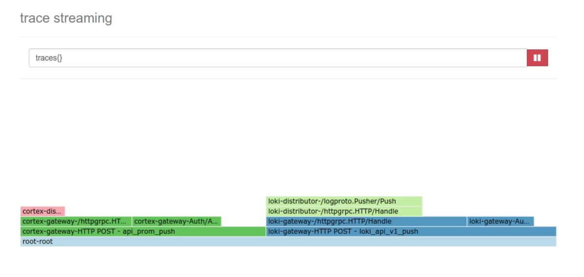

# trace streaming

A fledgeling project built on top of the [otel-collector](https://github.com/open-telemetry/opentelemetry-collector) to provide stream processing for traces.

## Awful Demo Site!

This demo site is awful, but it works just enough to test the functionality and get screenshots.

### Span Queries



### Trace Queries

Trace queries are currently visualized as a very poorly rendered flamegraph.



## Queries

The trace streaming project supports a query language roughly inspired by [prometheus](https://prometheus.io/docs/prometheus/latest/querying/basics/).  The basic format is:

`<type>{<condition>, <condition>, ...}`

### Examples

`spans{duration > 100}`  
Retrieves spans whose duration exceeds 100 ms.

`spans{process.name != parent.process.name}`  
Retrieves spans that cross process boundaries.

`traces{parent*.process.name = 'cortex-ingester', process.name = 'cortex-querier'}`  
Retrieves traces that follow a specific path through your services.

### Types

The only two currently supported types are `spans` or `traces`.  Both types support the same conditions (operands and fields).  However, the `spans` type returns individual spans while `traces` will return full traces.

### Conditions

Conditions support a set of standard binary operators and can be applied to static values or span fields in any combination.  If there are no conditions then all spans/traces are matched and returned.  If there are multiple conditions then all conditions they are "AND"ed together and all must return true.

Keep in mind that if the type differs between the two operands the operator will always return false.
```
spans{1="1"} => matches no spans
spans{1=1} => matches all spans
```

#### Operators

Supported operators 
```
=   -> equal
!=  -> not equal
<   -> less than
<=  -> less than or equal to
>   -> greater than
>=  -> greater than or equal to
=~  -> regex successful match
!~  -> regex failed match
```

Note that the regex operators will always return false if the operands aren't strings.

#### Fields

Supported span fields.
```
name
duration
process.name
status.code
status.message
atts["<attribute name>"]
parent.<span field>
parent*.<span field>
isRoot
```

**atts**
Attributes or tags are a key/value pairs stored along with the trace.

**parent**  
Parent refers to the parent of the currently evaluating span.

**parent\***  
Parent* refers to all parents of the currently evaluated span.

**isRoot**  
isRoot is an integer with the value 1 if this is a root span and 0 if not.

## todo

- propagate context/trace
- add support for other streams
  - traceheader
- web interface
- query language
  - friendlier error messages (remove FIELD_BLERG)
- export metrics
- cleanup/add tests
- streamers never removed from the slice in stream processor :)
- gracefully shutdown batch polling
- stream.go is not concurrency safe.
- build query frontend.  query frontend only hits enough collectors to satisfy the requested rate limit
- propagate and use zap logger
- make rate limiting not suck
- chain filters?
- start designing HA
  - custom topology keys to control sharding.
- add CI (codecov/build/tests)
- rough understanding of load
- syncpool for stream spans
  - https://www.cockroachlabs.com/blog/how-to-optimize-garbage-collection-in-go/
- use sync.Map instead of custom locking
- status code int matching instead of string?
- order matchers by cost.  i.e. int comparisons are fast, descendant/regex expressions are slow
- make root span first in trace slice for efficiency?
- switch to use opencensus/opentel protos
- flesh out query language
    - add support for metrics methods rate(), increase()
    - add support for selecting fields as a type
      - {}.duration as histogram
- configurable workers per query?
- add support for process tags