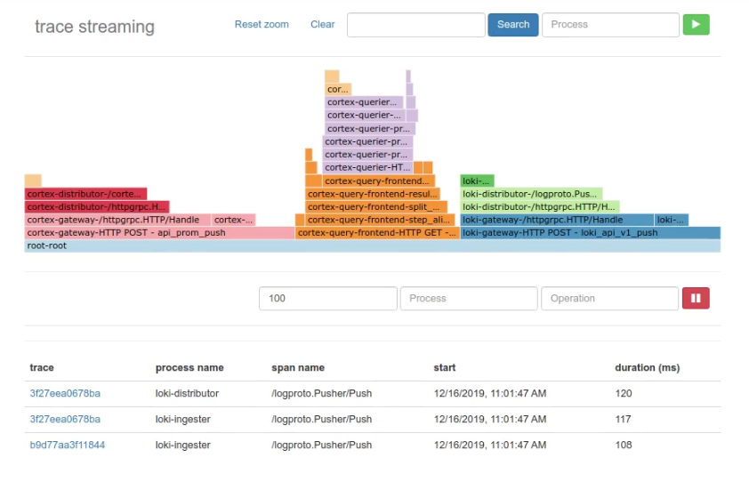

# trace streaming

A fledgeling project built on top of the [otel-collector](https://github.com/open-telemetry/opentelemetry-collector) to provide stream processing for traces.

## awful-demo-site

## todo

- propagate context/trace
- add support for other streams
  - traceheader
- web interface
- query language
- export metrics
- cleanup/add tests
- streamers never removed from the slice in stream processor :)
- gracefully shutdown batch polling
- stream.go is not concurrency safe.
- build query frontend.  query frontend only hits enough collectors to satisfy the requested rate limit
- propagate and use zap logger